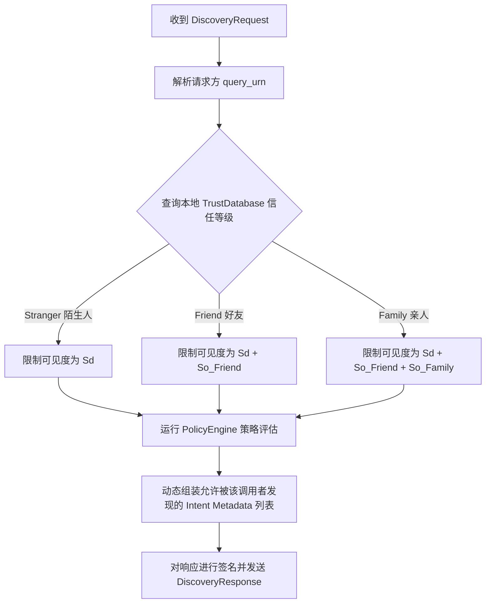
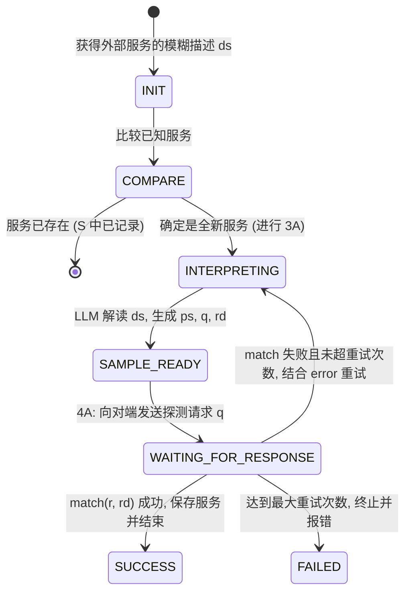

# 智能体服务发现与描述对齐规格说明书 (SERVICE_DISCOVERY.md) 🗺️

本文件详细阐述了 `agent-oncall` 中的**服务发现 (Service Discovery)** 全过程，包括智能体如何根据隐私与安全策略动态判定分享暴露等级，以及如何通过基于对话的描述对齐机制 (Service Description Alignment) 自动接入第三方服务。

---

## 🔒 1. 服务的分享暴露等级判定 (Exposure Levels)

为了在协作效率与隐私保护之间取得平衡，智能体对自身拥有的本地意图/工具（Intents/Tools）定义了三个分享暴露等级：

1.  **默认暴露级 (Disclosed by default - $S_d$)**：
    *   公开的服务，对网络中的任何智能体（包括陌生人 `Tier_3_Stranger`）都可见。例如：服务状态探针、公共信息查询等。
2.  **选择暴露级 (Optionally disclosed - $S_o$)**：
    *   受限服务，仅向建立了一定信任关系的节点暴露。例如：日程空闲查询（限好友 `Tier_2_Friend` 以上级别可见）、预订活动（限亲人 `Tier_1_Family` 级别可见）。
3.  **隐藏级 (Hidden - $S_h$)**：
    *   绝密服务，不对任何外部智能体公开。只能由宿主智能体自己本地调用。

### 判定与过滤流程

当 Responder 智能体收到外部发送的 `DiscoveryRequest` 时，其内部处理和暴露逻辑如下：



*   **策略引擎决策**：`PolicyEngine.evaluate_policy` 决定了具体 intent 能否在当前信任等级下展示。
*   **被动披露 (Passive Disclosure)**：陌生人进行发现时，返回的列表为空或仅包含默认公开工具。好友进行发现时，才动态暴露更多的功能。这种设计防止了内部服务被外部节点扫描，提供了更细粒度的边界安全。

---

## 🤝 2. 服务发现握手时序 (Discovery Handshake Flow)

当 Alice 的智能体需要协同 Bob 执行任务时，发现过程如下：

```
Alice's Agent                        Alice's OnCall                   Bob's OnCall                     Bob's Agent
      │                                    │                               │                                │
      │ 1. 查找可用功能                      │                               │                                │
      ├───────────────────────────────────>│                               │                                │
      │                                    │ 2. 构建 DiscoveryRequest       │                                │
      │                                    ├──────────────────────────────>│                                │
      │                                    │   (经 agent-comm 通道传输)     │                                │
      │                                    │                               │ 3. 评估安全策略                 │
      │                                    │                               ├──────────┐                     │
      │                                    │                               │          │ 根据 Alice_URN       │
      │                                    │                               │<─────────┘ 过滤暴露的意图        │
      │                                    │                               │                                │
      │                                    │ 4. 返回 DiscoveryResponse      │                                │
      │                                    │<──────────────────────────────│                                │
      │                                    │   (仅包含允许 Alice 调用的意图)│                                │
      │ 5. 返回 Intent 清单 (含 Schema)     │                               │                                │
      │<───────────────────────────────────┤                               │                                │
```

---

## 🔄 3. 服务描述对齐 (Service Description Alignment - SDA)

智能体发现对端暴露的服务后，由于各个厂商或系统的差异，返回的 `description` 和 `input_schema` 可能存在命名歧义或不可直接调用性。智能体通过**服务描述对齐对话**（Fig 3 状态机）在后台自动完成 Schema 适配。

### 状态机转换过程 (Fig 3)



#### 关键步骤详解：

1.  **Compare (比对验证)**：
    *   Requester 检查本地的已知服务列表 $S$ 中，是否已经存在该服务描述 $ds$ 的精确对齐模型。若存在，退出流程；若不存在，开始对齐。
2.  **3A. Interpret (解释推理 - 依赖大模型)**：
    *   智能体通过大模型（LLM Aligner）解析模糊描述 $ds$。
    *   推导出该服务在本地的标准配置文件格式 $ps$。
    *   构建一个探测请求样本 $q$（Sample Request）以及预期的响应结果 $rd$（Expected Response）。
3.  **4A. Request & Send (发送探测)**：
    *   Requester 通过 `CallRequest` 将探测请求 $q$ 发送给对端。
4.  **Respond (响应)**：
    *   对端执行该探测请求 $q$，返回实际的响应结果 $r$。
5.  **Match & Confirm (核对验证 - 依赖大模型)**：
    *   Requester 利用大模型（LLM Matcher）比对对端实际返回的 $r$ 与预期的 $rd$ 是否语义相似 (`match(r, rd)`)。
    *   **成功对齐**：若匹配成功，代表智能体已准确理解此服务的调用机制，将 $ps$ 正式保存为可用服务，并结束流程。
    *   **重试/失败机制**：若匹配失败（例如对端返回错误参数提示），Requester 将错误信息回传给 LLM 再次进行解释（重新调整 $q$ 和 $rd$），并重新发起请求。如果重试次数达到限制（$max\_attempts$），则宣告对齐失败，放弃接入。

---

## 🎯 4. 数据驱动的细粒度策略控制 (Data-Driven Policy Control & Wildcard Override)

在评估调用方的安全策略时，`agent-oncall` 支持对每个独立智能体进行精细化的权限隔离，并提供灵活的通配符匹配规则。

### 权限校验执行顺序

当 Responder 收到调用方的 URN 后，按照以下顺序校验对端是否有权执行指定的 Intent（例如 `calendar.query`）：

1.  **个体级权限特许 (URN Overrides)**：
    *   首先检查 `contacts` 数据库中该特定 URN 下的 `allowed_intents`（允许的意图规则列表）。
    *   如果该列表中包含此意图（或可匹配的通配符模式），则**直接放行**。这使得我们可以针对特定合作伙伴进行特许授权，而无须调整其全局信任级别。
2.  **级别级权限匹配 (Global Tier Permissions)**：
    *   如果个体无特许，则查询该 URN 的全局信任等级（默认未配对节点为 `Tier_3_Stranger`）。
    *   查询该信任等级关联的 `tier_permissions` 意图匹配规则列表。
    *   如果包含此意图（或可匹配的通配符模式），则**放行**。
3.  **默认拒绝 (Default Deny)**：
    *   若上述两项检查均不通过，则拦截调用，拒绝访问。

### 通配符支持

为了简化策略定义，策略匹配器支持以下通配符：
- `*`：匹配所有意图。例如给 `Tier_1_Family` 配置 `["*"]`，将直接放行其全部意图调用。
- `calendar.*`：前缀通配匹配。允许调用所有以 `calendar.` 开头的意图（如 `calendar.query`、`calendar.book_event`），但不允许调用 `system.reboot`。
- 精确命名：例如 `calendar.query_availability`。只允许调用该指定的单一意图。
